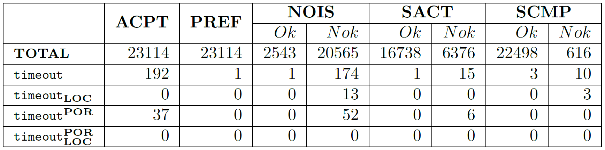
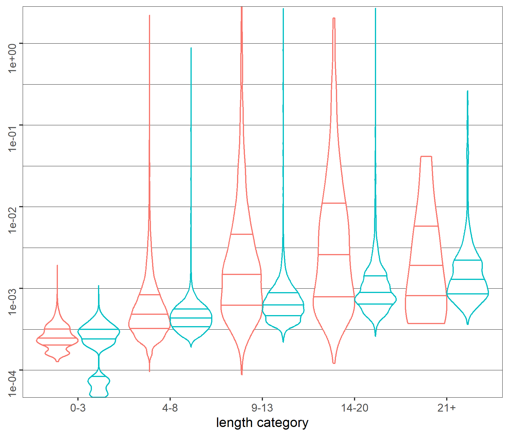
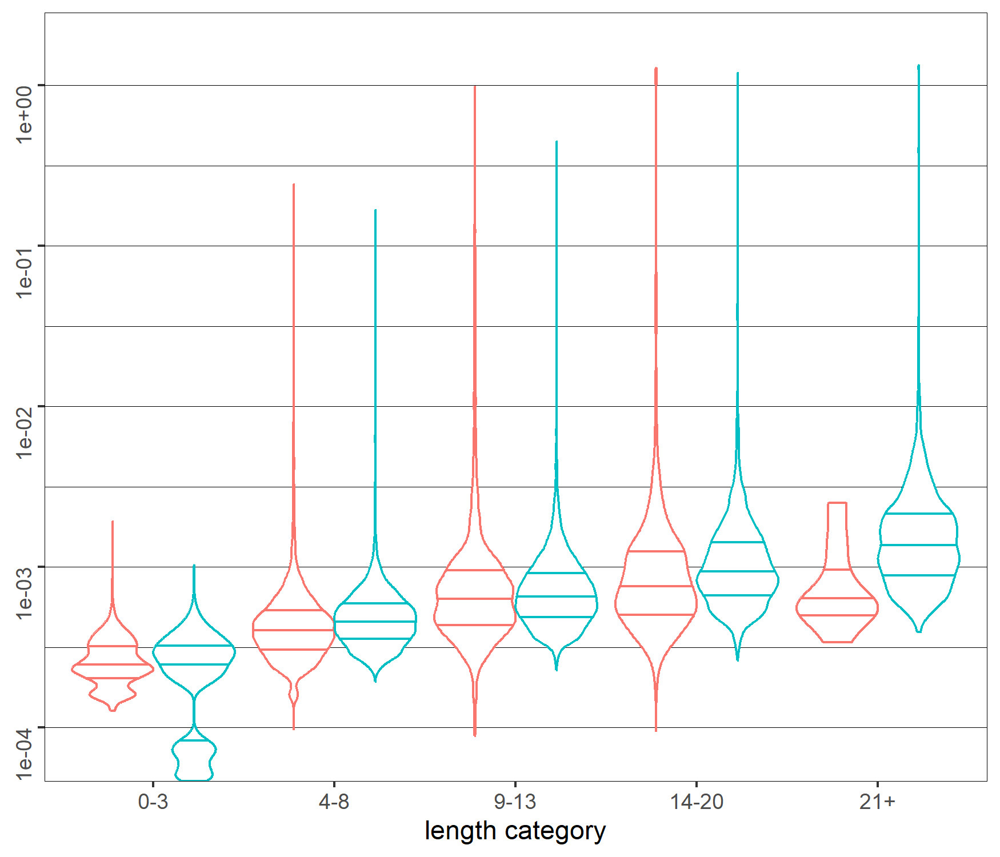
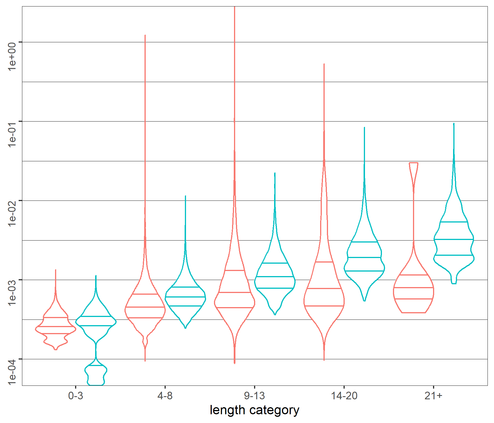
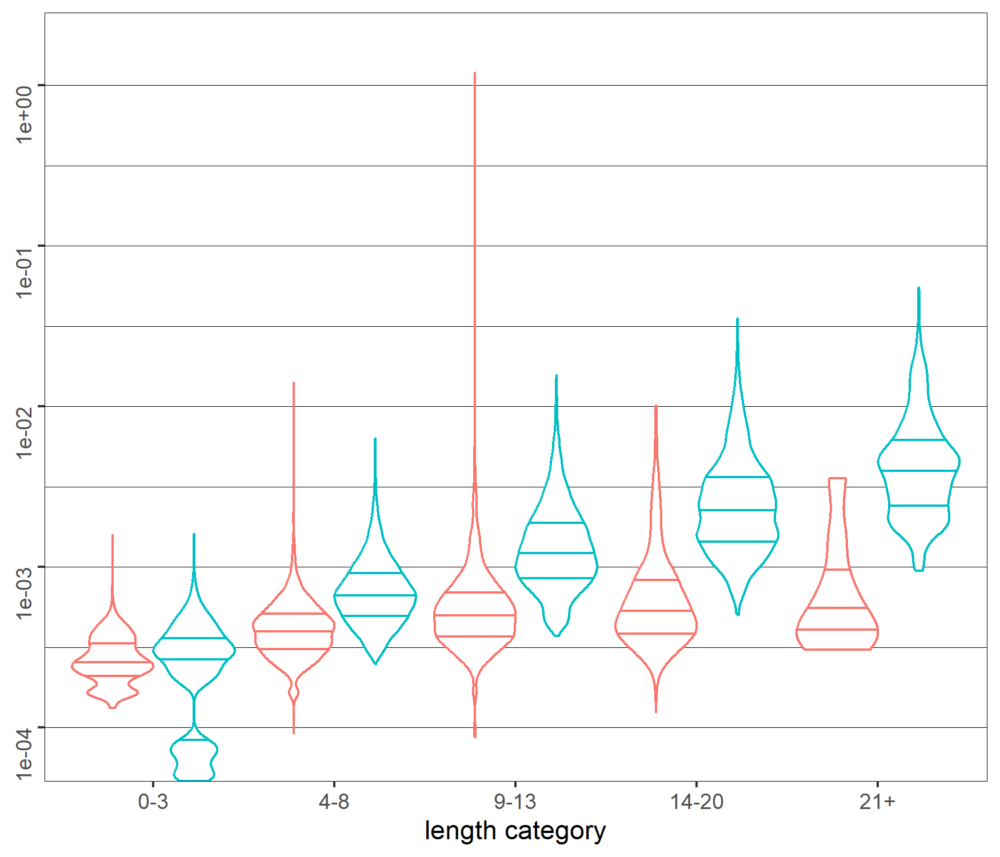

# Experimental evaluation of the analysis time for HIBOU's multi-trace analysis algorithm with lifeline removal steps

This is the continuation of experiments on the graph size from [this repository](https://github.com/erwanM974/hibou_lfrem_por_loc_graph_size_benchmark).

Instead of focusing on the size of the analysis graph, we focus on the time required to either:
- find a path towards the *Ok* verdict (which, if and once it is done do not require further exploration of the graph)
- or prove that no such path exist (which requires exploring the whole graph)

Please refer to [this repository](https://github.com/erwanM974/hibou_lfrem_por_loc_graph_size_benchmark).
for further details.

Algorithms that exploit this graph definition for Offline Runtime Verification are implemented 
in "[hibou_label](https://github.com/erwanM974/hibou_label)".
We perform the following experiments on that tool.

## The two techniques

We consider 2 techniques to reduce the size of the graph:
- a technique of Partial Order Reduction (POR) which relies on the identification of one-unambiguous actions that
can be safely selected as a unique start event for linearization
- a technique of LOCal analyses (LOC) which relies on analyzing each local component of the multi-trace independently

These techniques have an impact on the size of the analysis graph but, incidentally, have also a different impact on the
time required for the analysis via two counteracting mechanisms:
- the reduction of the graph size mechanically reduces the time required to traverse it
- because the graph is not known in advance, and all computations are done on the fly, the use of these techniques
themselves mechanically increases the analysis time as they incur an overhead

## The input dataset

We use the exact same dataset as in [this repository](https://github.com/erwanM974/hibou_lfrem_por_loc_graph_size_benchmark).

In practice, we have around *120 000* datapoints.

## The timeouts

We performed the experiments on an Intel(R) Core(TM) i5-6360U CPU (2.00GHz) with 8GB RAM with HIBOU version 0.8.7.
We set a $3$ seconds timeout for the analysis time.

Contrasting the results from [this repository](https://github.com/erwanM974/hibou_lfrem_por_loc_graph_size_benchmark) 
we remark, in the table above, the following.

Using the same *3* seconds timeout, we observe, 
different results than in [this repository](https://github.com/erwanM974/hibou_lfrem_por_loc_graph_size_benchmark)
concerning the occurrences of timeouts. 
Indeed, the fact that we do not need to compute the whole subgraph greatly improves performances for 
*Ok* multi-traces, which mechanically reduces the number of timeouts (especially for ``ACPT`` full accepted traces).

## The analysis time

|          | no POR                                           | with POR                                         |
|----------|--------------------------------------------------|--------------------------------------------------|
| no LOC   |  |  | 
| with LOC |  |  |

Contrasting the results from [this repository](https://github.com/erwanM974/hibou_lfrem_por_loc_graph_size_benchmark) 
we remark, in the diagrams above, the following.

The use of DFS and a stopping criterion generally makes the analysis of *Ok* multi-traces less time consuming 
than their *Nok* counterparts of similar length in the baseline case 
(i.e., we use neither POR nor LOC).
Indeed, while for the former we do not need to compute the whole subgraph, 
it remains the case for the latter and, without additional techniques, the size of that subgraph may remain similar. 
This can be observed on the top left diagram (looking at the median and quartiles of each distribution).

The effect of LOC remains the same as in [this repository](https://github.com/erwanM974/hibou_lfrem_por_loc_graph_size_benchmark)
(especially without POR). 
However, it is not as spectacular because we do not measure graph size but analysis time and, 
while for the former, the cost of local analyses is hidden, 
it is not the case for the latter (the time for the global analysis includes the sum of the times for all local analyses).
This also causes the times for *Ok* multi-traces with POR and LOC to be slightly higher than 
that for *Ok* multi-traces with POR but without LOC. 
Indeed, when analyzing correct behaviors, local analyses may only incur an overhead, 
without necessarily reducing the number of vertices that need to be explored.
This overhead effect increases with the size of the multi-trace but can be mitigated via manipulating a look-ahead depth 
or using additional heuristics to condition the use of local analyses on specific lifelines.

## How to use

We use the same input dataset as in [this repository](https://github.com/erwanM974/hibou_lfrem_por_loc_graph_size_benchmark) 
in which you will find the code to regenerate the raw data from scratch.

In this repository, the *120 000* vertices *(i,mu)* are in the "gen_ints" folder.
For every one of theses *120 000* *(i,mu)*, we analyze *mu* (the observed behavior) against *i* (the specification)
and keep track of the time required for the analysis for each of our 4 methods (we retain the median of 3 trials).

Unlike in [this repository](https://github.com/erwanM974/hibou_lfrem_por_loc_graph_size_benchmark) 
we do not compute the whole reachable subgraph but instead simply look for paths towards *Ok* using 
a simple Depth First Search strategy.

Use the "main.py" Python script to run the analyses. It will:
- for each of the 120 000 trace it will run the graph exploration using the 4 methods with a timeout of 3 secs
- for each of the 120 000 traces, it will create a row in a "results_time.csv" CSV table

This process may take some time (about 5 hours on a lower average 2020 era laptop).
Alternatively, you can use the precomputed data in "results_time_saved.csv".

Once you have a CSV table named "results_time.csv" you can run the R script "plot_partial_order_local_analyses_time.R".
It will print and plot relevant data found in the CSV file.

